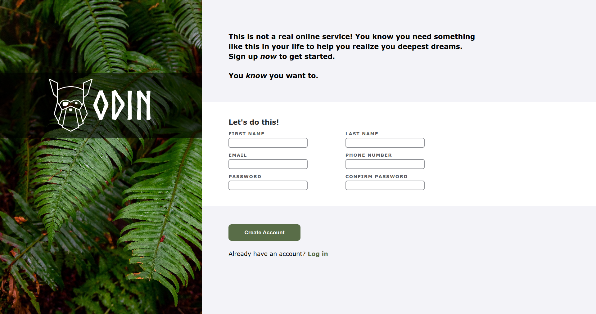

# Sign-up Form

## Preview

## Description
* A simple sign-up form.

## Made with
* HTML, CSS and JavaScript.

## Visit website
* [Link](https://jovan-nsty.github.io/sign-up-form/)

## Purpose
* The purpose of this project was to build a website page that mimics a standard website registration/sign in process.

* This project was done following The Odin Project curriculum.